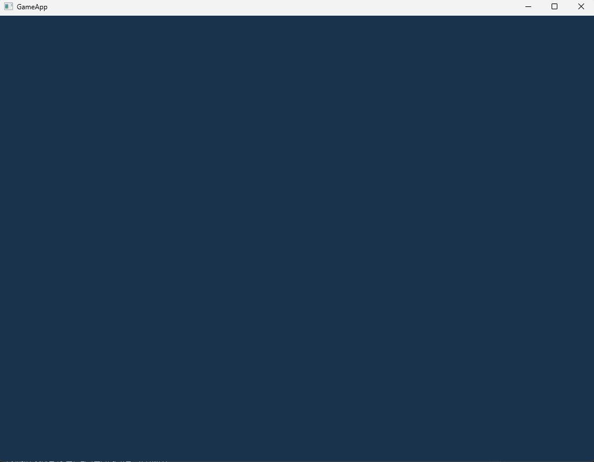

## 프로젝트 개요

스왑 체인과 Render target view(RTV)를 생성하고 화면에 Clear한 뒤 Present를 사용하는 기본 랜더 루프를 구현 했습니다.

DirectX11 파이프라인에서 Output-Merger 단계의 구조와 화면이 실제로 출력하는 과정을 이해하는 것이 핵심입니다.

## 핵심 기술 포인트

- flip mode 스왑체인 구성
- 백 버퍼 획득 및 RTV 생성 과정
- Output-Merger 단계에서 RTV 바인딩

### 그래픽스 파이프라인에서의 위치

이 프로젝트는 주로 Output-Merger 단계를 이룹니다.

여기서 GPU가 최종 픽셀 데이터를 렌더 타겟 ( 백 버퍼 )에 출력하고 

스왑 체인의 Present() 호출을 통해 화면에 전송됩니다.

## 구현에서 중요한 점

1. Flip Model 사용 이유

Flip Model은 Blt Model보다 성능이 좋고, Window 10이후 대부분의 현대 디스플레이 구성에서 권장됩니다.

핵심 차이점

- Blt : 백 버퍼 → 화면 메모리로 복사
- Flip : 백 버퍼 포인터를 교체
    
    → 더 빠르고 tearing 없음.
    

```cpp
#if USE_FLIPMODE == 1
	swapChainDesc.BufferCount = 2;
	swapChainDesc.SwapEffect = DXGI_SWAP_EFFECT_FLIP_DISCARD;
#else
	swapChainDesc.BufferCount = 1;
	swapChainDesc.SwapEffect = DXGI_SWAP_EFFECT_DISCARD;
#endif
```

1. RTV 바인딩과 Clear

ClearRenderTargetView는 Gpu 명령 큐에 “해당 화면을 이 색으로 지워라”라는 명령을 하는 과정입니다.

해당 작업은 실제로 DirectX 파이프라인에서 화면을 그릴 준비를 하는 최초의 Render pass 흐름입니다.

```cpp
void TutorialApp::OnRender()
{
#if USE_FLIPMODE == 1
	// Flip 모드에서는 매프레임 설정해야한다.
	m_pDeviceContext->OMSetRenderTargets(1, m_pRenderTargetView.GetAddressOf(), NULL);
#endif	

	Color color(0.1f, 0.2f, 0.3f, 1.0f);

	// 화면 칠하기.
	m_pDeviceContext->ClearRenderTargetView(m_pRenderTargetView.Get(), color);

	// 스왑체인 교체
	m_pSwapChain->Present(0, 0);
}
```

## 잠재적 문제

1. Flip model 사용 시 매 프레임마다 OMSetRenderTargets 설정을 하지 않으면 화면이 그려지지 않을 수 있다.
    
    → Flip model은 매 프레임마다 백버퍼가 바뀌는 구조이므로 버퍼가 바뀌면 RTV를 다시 설정해 줘야한다.
    
2. Present 옵션에 따라 vsync ON/OFF 가 달라진다.
    
    → `Present(1,0)` 으로 ON, `Present(0,0)` 으로 OFF 이 가능하다. vsync를 키면 더 부드러운 화면느낌을 줄 수 있다. ( 보통 영상출력할 때 사용 )
    
3. wndproc에서 화면 Resize 이벤트를 처리하지 않으면 flip model에서 화면 깨짐이 발생할 수 있다.
    
    → 화면이 찢어지거나 일부 영역만 그리는 현상이 발생할 수 있다. Resize 이벤트가 들어오면 화면 크기에 맞는 새 백 버퍼를 만들고 RTV를 재설정한다.
    

## 실행 결과

;

## 배운 점

- 현대 DirectX11에서 Flip Model을 쓰는 이유 ( 성능 / 지연 감소 / OS권장 )
- 랜더 루프는 Clear → Draw → Present 구조로 이어지며, 모든 DirectX 프로젝트의 근간이 된다.
- RTV는 GPU가 “ 여기에 출력하라 “라고 지시받는 대상이며, OM단계에서 백 버퍼와 연결이 된다.