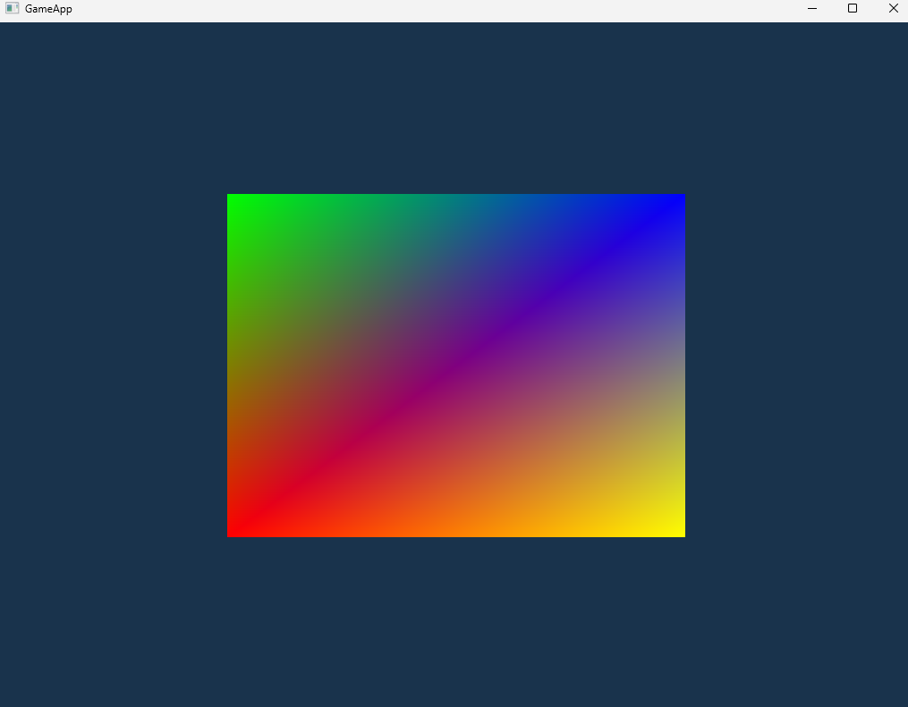
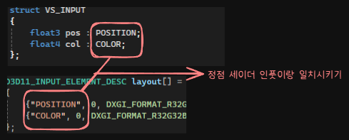
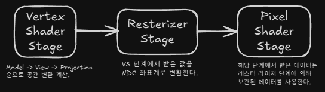

## 1. 프로젝트 개요
NDC 좌표계로 직접 정점들을 설정하여 정점 버퍼와 인덱스 버퍼를 생성하고, 정점 셰이더와 픽셀 셰이더를 사용해 화면에 사각형을 출력합니다.

vertex shader 단계와 레스터라이저 단계, 픽셀 셰이더 단계를 이해하고 사각형이 출력되는 것을 이해합니다.

## 2. 핵심 기술 포인트

- vertex shader 단계에서 사용할 데이터 구조 정의 InputLayout 설정하기
- 변환 행렬 없이 화면 출력 이해를 목표로 NDC 좌표계를 직접 작성해서 정점 버퍼 생성하기
- 정점 중복 제거와 vertex chache 활용을 위해 인덱스 버퍼 생성하기
- vertex shader stage(VS) 와 pixel shader stage(PS) 설정하기

## 3. 그래픽스 파이프라인에서의 위치

1. Input Assembler
    - IA 단계의 IASetPrimitiveTopology를 통해 어떻게 그릴지 설정할 수 있다.
        traanglelist가 사용되는 이유는 아래와 같다.
        
        1. 정점 3개마다 하나의 삼각형이 완결된다 → GPU 입장에서 해석이 단순해짐.
        2. 인덱스 버퍼를 사용 시 버리는 정점이 없다.
        3. 삼각형 기반으로 래스터라이즈하는 방식가 가장 잘맞는다.

    - IASetVertexBuffers로 그릴 정점 버퍼를 설정할 수 있다.
    - IASetInputLayout로 VS 단계에 넘겨줄 데이터 구조를 설정할 수 있다.  
  
2. VertexShader Stage
    - `VSSetShader`를 통해 VS 단계에서 사용할 정점 셰이더 설정할 수 있다.
        각 정점에 대해 한 번씩 호출 되며 정점의 위치 변환과 정점 단위 연산을 수행한다.
        최종적으로는 클립 공간 위치를 출력해야한다.  
          
      
3. PixelShader Stage
    - `PSSetShader` 를 통해 PS 단계에서 사용할 픽셀 셰이더 설정할 수 있다.
        각 프레그먼트 ( 화면 픽셀 후보 )에 대해 호출되어 최종 픽셀 색을 계산한다. 
        PS는 resterizer가 보간된 값을 입력으로 받는다.  
  
4. Rasterizer Stage  
    - VS가 출력한 정점들을 삼각형으로 연결하고(토폴로지 기준), 클리핑을 하고, `w`로 나눠 NDC로 변환한 뒤 뷰포트로 매핑해 픽셀(프래그먼트)을 생성한다. 또한 보간(interpolation), culling, scissor, MSAA 처리를 담당한다.
      

## 4. 구현에서 중요한 지점

1. TriangleList 사용한 이유
    
    DirectX에서는 사각형 primtive가 없기 때문에 TriangleList 방식을 사용해 두개의 삼각형을 이어 붙여서 사각형을 표현한다. 해당 방식때문에 정점 4개와 인덱스 6개가 필요하다.
    
2. 인덱스 버퍼를 사용한 이유
    
    인덱스 버퍼를 사용하면 정점의 중복 선언을 줄이고, GPU 내부의 vertex cahce를 활용할 수 있다.
    

## 5. 개발 과정에서 겪은 문제 & 해결

 - 인덱스 순서가 뒤집히면 역상으로 그려지거나 컬링으로 인해 안그려질 수 있다.

→ 시계/반시계 방향에 따른 frontFcae 기준과 CullMode를 확인.

 - InputLayout 오프셋이 틀리면 shader로 전달하는 구조가 깨져서 오류가 발생한다.

→ 렌더 파이프라인을 설정할 때 InputLayout과 정점 셰이더에 넘길 데이터 구조를 확인.

 - Shader 파일의 경로가 빌드 기준 상대 경로라 실행 위치에 따라 로딩에 실패 할 수 있다.

→  셰이더만 있는 폴더를 따로 설정해줘서 정리한다.

## 6. 실행 결과

## 7. 배운 점 & 다음 단계로 이어지는 포인트

- draw 호출전 vertex shader stage와 pixel shader stage 설정하여 랜더 파이프 라인단계에서 무슨 셰이더 파일을 사용할지 정할 수 있다.
- 정점 셰이더에 넘겨줄 Inputlayer 설정할 때  아래와 같이 시멘틱 이름과 설정이 일치해야한다.  

- 사각형 색상이 무지개처럼 나오는 이유는 VS 단계에서 PS 단계로 거칠 때 Resterizer 단계에서 값을 보간하여 데이터를 넘겨줍니다.
    
    Resterizer 단계는 항상 클리핑, 원근 분할을 수행하여 정점들을 같은 공간으로 변환하고 뷰포트에 매핑합니다. ( NDC 좌표계 )

