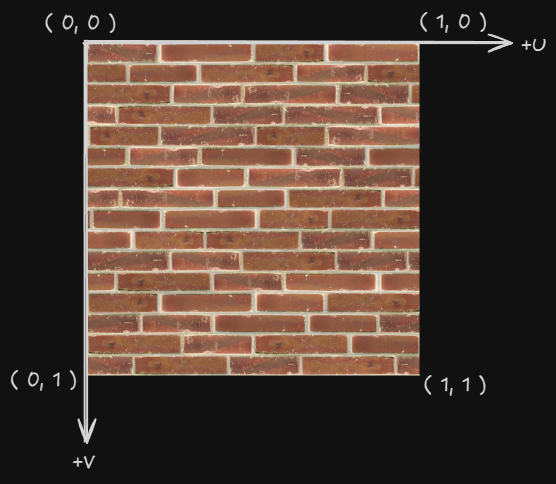

## 1. 프로젝트 개요

이전 프로젝트(DrawMesh)의 단색 큐브에서 발전하여,
텍스처 매핑을 구현한 프로젝트입니다.

GPU가 텍스처 데이터를 읽기 위한 Shader Resource View(SRV) 생성,
텍스처 샘플링을 위한 Sampler State 설정,

정점에 UV 좌표 추가를 통해 큐브 표면에 이미지를 매핑합니다.

DirectXTK의 DDSTextureLoader를 사용해 DDS 포맷 텍스처를 로드하고,
3개의 회전하는 큐브에 동일한 텍스처를 적용합니다.

## 2. 핵심 기술 포인트

- ShaderResourceView 객체를 이용해 셰이더에서 사용할 텍스처를 저장합니다.
- SampleState를 사용해 셰이더에서 텍스처 샘플링을 합니다.

## 3. 그래픽스 파이프라인에서의 위치

1. IA 단계
    - 기존 Vertex 구조체에 UV 좌표 데이터 추가
    - Input Layout에 TEXCOORD  semantic 추가 정의
    
2. PS 단계
    - Texture2D와 SamplerState를 파라미터로 받음
    - 보간된 UV 좌표로 Sample() 함수 호출
    - 샘플링된 텍스처 색상을 최종 픽셀 색상으로 반환

## 4. 구현에서 중요한 지점

1. 샘플러 객체 생성하기
    
    `ID3D11SamplerState` 객체를 만들어서 `CreateSamplerState()` 함수로 샘플러 생성
    
2. 픽셀 셰이더에 사용할 자원하고 샘플러 설정하기
    
    `PSSetShaderResources()` 사용할 텍스처 자원 넘기기
    
    `PSSetSamplers()` 로 `ID3D11SamplerState` 설정하기
    
3. 텍스처 샘플링하기
    
    `txDiffuse.Sample(SamplerState, UV Coord)` 로 텍스처 샘플링하고 픽셀 셰이더 최종 값으로 반환하기 
    

## 5. 개발 과정에서 겪은 문제 & 해결

1. 텍스처가 큐브 면에 뒤집히거나 왜곡되어 출력
    - 문제:
        
        텍스처가 상하 반전되거나 큐브의 특정 면에서 늘어남
        
    - 원인:
        
        UV 좌표 시스템을 잘못 이해
        
        - DirectX는 좌측 상단이 (0,0), 우측 하단이 (1,1)
        - 각 면의 정점 순서와 UV 좌표가 일치하지 않음
    - 해결:
        
        각 면의 정점 와인딩 순서에 맞춰 UV 좌표 재배치
        윗면: (1,0) → (0,0) → (0,1) → (1,1)
        

## 6. 실행 결과
(스크린샷 또는 GIF)

## 7. 배운 점

- CPU(C++)와 GPU(HLSL) 양ㅎ쪽에서 텍스처 파이프라인 구성 필요
    - C++: 리소스 생성 + SRV 생성 + Sampler State 생성 + 바인딩
    - HLSL: Texture2D/SamplerState 변수 선언 + Sample() 호출
- UV 좌표계의 중요성
    - (0,0)은 좌측 상단, (1,1)은 우측 하단
    - 정점 순서와 UV 좌표가 정확히 매칭되어야 왜곡 없음
    