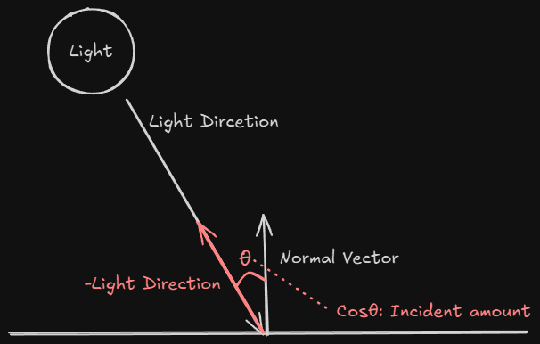

## 1. 프로젝트 개요

정점에 법선 벡터(Normal Vector)를 추가하고,
Lambert's Cosine Law를 적용한 Diffuse 조명 계산을 통해
큐브 표면에 입체감과 음영을 부여합니다.

## 2. 핵심 기술 포인트

- Lambert's Cosine Law 구현
    - 조명 강도 = max(0, dot(-lightDir, normal)) × lightColor
    - dot 연산으로 빛과 표면이 이루는 각도의 코사인 값 계산
    - saturate()로 음수 값 제거 (뒷면은 어둡게)
- 법선 변환 문제 (비균등 스케일 대응)
    - World 행렬로 법선을 변환하면 비균등 스케일 시 왜곡 발생
    - World 행렬의 역전치 행렬(Inverse Transpose)로 법선 변환 필요
    - 이 프로젝트에서는 균등 스케일만 사용하여 문제 회피
- 상수 버퍼 확장
    - MVP 행렬 외에 lightDirection, lightColor 추가
    - 방향성 광원(Directional Light) 구현

## 3. 그래픽스 파이프라인에서의 위치

- PS 단계
    - 보간된 법선 정규화: normalize(input.normal)
    - Lambert 공식 적용: dot(-lightDir, normal)
    - saturate()로 [0,1] 범위 클램핑
    - 기본 색상에 조명 강도 곱하기: baseColor × intensity × lightColor

## 4. 구현에서 중요한 지점

1. Lambert's Cosine Law 구현 
    
    ```
       float intensity = saturate(dot(-lightDirection, normal));
       finalColor = baseColor * intensity * lightColor;
    ```
    
    - dot 연산: 두 벡터가 이루는 각도의 cos 값 반환
    - 빛과 표면이 수직(-90도)이면 1.0 (최대 밝기)
    - 평행(0도)이면 0.0 (어두움)
    - saturate: 음수(뒷면)를 0으로 클램핑
    - 왜 -lightDirection? : DirectX는 빛이 "향하는" 방향을 사용
    
2. 비균등 스케일 문제와 해결
    - 문제 : World 행렬로 법선 변환 시 스케일(2, 1, 1)이면 법선이 늘어남
    - 원인 : 법선은 방향만 필요한데 위치 변환 행렬은 크기도 적용
    - 해결 : World 행렬의 역전치 행렬(Inverse Transpose) 사용

```
     float3 worldNormal = mul(normal, (float3x3)worldInverseTranspose);
```

- 이 프로젝트: 균등 스케일(1, 1, 1)만 사용하여 문제 회피
- API : 없음 (향후 프로젝트에서 상수버퍼에 역전치 행렬 추가 필요)

1. 상수 버퍼 확장

```cpp
   struct ConstantBuffer {
       Matrix world, view, projection;
       Vector4 lightDirection;  // 방향성 광원
       Color lightColor;        // 조명 색상
       Color outputColor;       // 광원 자체 렌더링용
   };

```

- PS에도 상수버퍼 바인딩 : `PSSetConstantBuffers()`
- 왜? : 조명 계산이 PS에서 수행되므로

## 5. 예상하는 문제 

1. 비균등 스케일 시 조명이 왜곡됨
    - 문제 :
    큐브에 (2, 1, 1) 스케일 적용 시 조명 음영이 부자연스럽게 늘어남
    특히 X축 방향 면이 과도하게 밝거나 어둡게 표시됨
    - 원인 :
    법선 벡터를 World 행렬로 변환하면서 스케일도 함께 적용됨
    예: (1, 0, 0) 법선에 (2, 1, 1) 스케일 → (2, 0, 0)으로 늘어남
    dot 연산 전 정규화하지 않으면 잘못된 조명 강도 계산
        
        수학적 배경:
        
        - 법선은 "방향"만 의미 (크기 무의미)
        - 위치 벡터는 점을 나타냄 (크기 의미 있음)
        - World 행렬은 위치 변환용이므로 법선에 직접 적용 불가
    - 해결 :
    방법 1) 균등 스케일만 사용 (현재 프로젝트 적용)
        - 코드에서 CreateScale(1, 1, 1) 또는 동일 값만 사용
        - 임시 방편이지만 학습용으로는 충분
        
        방법 2) World 행렬의 역전치 행렬 사용 (정석)
        
        c++
        
        ```cpp
            Matrix worldInvTranspose = world.Invert().Transpose();
            // 상수버퍼에 추가
            cb.worldInverseTranspose = XMMatrixTranspose(worldInvTranspose);
        ```
        
        HLSL
        
        ```
            // Vertex Shader
            output.normal = mul(input.normal, (float3x3)worldInverseTranspose);
            output.normal = normalize(output.normal);
        ```
        

1. 법선 보간 후 정규화 누락
    - 문제 :
    Rasterizer에서 보간된 법선 벡터의 길이가 1이 아님
    조명 계산 결과가 어둡거나 불규칙하게 나타남
    - 원인 :
    선형 보간은 벡터의 크기를 보존하지 않음
    예: (1,0,0)과 (0,1,0)의 중점은 (0.5,0.5,0)으로 길이가 0.707
    - 해결 :
    Pixel Shader에서 normalize() 호출
        
        ```
          float3 normal = normalize(input.normal);
          float intensity = saturate(dot(-lightDir, normal));
        
        ```
        
    - 추가로 이해한 점 :
    VS에서 정규화해도 PS에서 다시 정규화 필요하다. 보간 과정( Rasterizer 단계 ) 에서 길이가 변하기 때문이다.

## 6. 실행 결과

## 7. 배운 점

- Lambert's Cosine Law의 수학적/물리적 의미
    - 표면과 빛이 수직일 때 최대 밝기
    - 각도가 커질수록(평행에 가까워질수록) 어두워짐



- 법선 벡터의 중요성
    - 조명 계산의 핵심은 “표면의 방향” 이다. Rasterizer가 값을 보간할 때 노말 값이 변형될 수 있으므로 졍규화를 한 번 하고 계산한다.