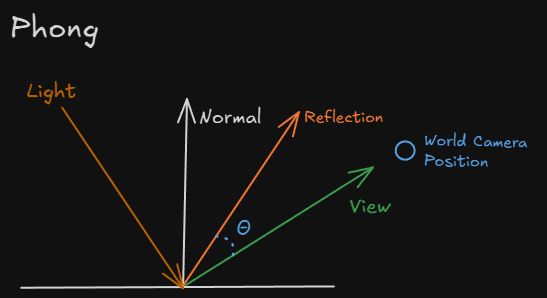
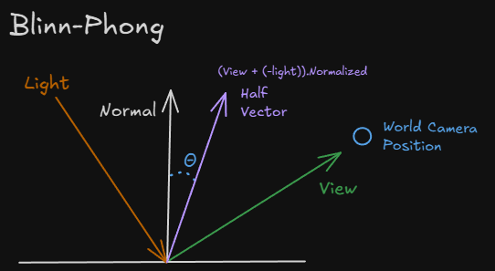

## 1. 프로젝트 개요
셰이딩 모델 중 하나인 PhongShading 모델을 구현을 합니다.

Phong Shading에서 환경광 ( ambient ), 주변광 ( diffuse ), 정반사광 ( specular ) 이 어떻게 적용되는지 이해합니다.

PhongShading과 Blinn-Phong Shading 연산의 차이를 비교해봅니다.

## 2. 핵심 기술 포인트

- 환경광 결정
    - 물체는 “ 재질의 색 * 빛의 색 “ 을 통해 결정한다.
    
- 확산광 결정
    - ( 빛 방향 dot 표면 노말 ) * 물체 재질의 확산광 색 * 빛의 확산광 색에 의해 결정된다.
    - 텍스쳐 요소도 해당 값에 곱한다.

- 정반사광 결정
    - Phong :  ( 반사각 dot 시선 벡터 ) ^광택값 * 재질 정반사광 색 * 빛의 정반사광 색
    - Blinn-Phong : ( half벡터 dot 노말 벡터 ) ^ 광택 값 * 재질 정반사광 색 * 빛의 정반사광

## 3. 그래픽스 파이프라인에서의 위치

- Pixel Shader
    
    빛의 광들과 재질 광에 따라 최종 출력 값을 결정한다.
    

## 4. 구현에서 중요한 지점

1. 빛과 물체의 각 환경광, 확산광, 정반사광 값 GPU에 넘겨주기
    
    빛 내용 추가
    
    ```cpp
    cbuffer ConstantBuffer : register(b0)
    {
        matrix World; // 큐브 월드 
        matrix View;  // 카메라 뷰 
        matrix Projection; // 카메라 투영
        
        float4 LightDirection; // 빛의 방향 ( 정규화됨 )
        float4 LightColor;    // 빛의 색갈
            
        float4 LightAmbient; // 환경광
        float4 LightDiffuse; // 난반사
        float4 LightSpecular; // 정반사
        
        float Shininess; // 광택지수
        float3 CameraPos; // 카메라 위치
    }
    ```
    
    오브젝트가 사용할 머터리얼 정보
    
    ```cpp
    cbuffer Material : register(b1)
    {
        float4 matAmbient; // 큐브의 주변광
        float4 matDiffuse; // 큐브의 확산광
        float4 matSpecular;  // 큐브의 정반사광
    };
    ```
    

2. 환경광 ( Ambient ) 계산하기
    
    ```cpp
    float4 finalAmbient = matAmbient * LightAmbient;
    ```
    

3. 확산광 ( Diffuse ) 계산하기
    
    ```cpp
    float4 finalTexture = txDiffuse.Sample(samLinear, input.Tex);  // 텍스처 샘플링
    
    float4 finalDiffuse = finalTexture * diffuseFactor * matDiffuse * LightDiffuse * LightColor;
    ```
    

4. 정반사광 ( Sepcular ) 계산하기
    1. Phong 
    
    ```cpp
    // Phong
    float3 reflectionVector = reflect(normalize((float3)LightDirection), norm); // 
            
    // reflection calculates 
    // float3 i = normalize((float3) LightDirection);
    // float3 n = norm; 
    // float3 reflectionVector = i - 2 * n * dot(i, n);
            
    float specFactor = pow(max(dot(reflectionVector, normalize(CameraPos - input.World)), 0.0f), Shininess);
            
    finalSpecular = specFactor * matSpecular * LightSpecular * LightColor;
    ```
      


    b. Blinn-Phong
    
    ```cpp
    // 정반사광        
    float3 viewVector = CameraPos - input.World;        
    float3 halfVector = viewVector + -(float3)LightDirection;        
    float specularFactor = pow(saturate(dot(norm, normalize(halfVector))), Shininess);
    
    finalSpecular = specularFactor * matSpecular * LightSpecular * LightColor;
    ```
      

5. 출력할 색상 반환하기
    
    ```cpp
    float4 finalColor = finalAmbient + finalDiffuse + finalSpecular; // 최종 색
    finalColor.a = finalTexture.a;
        
    return finalColor;
    ```
    

## 5. 개발 과정에서 겪은 문제 & 해결 

1. 정반사광이 그림자에서 발생함
    - 문제 :
        
        정반사 광이 빛이 없는 곳인 그림자 면에서 발생
        
    - 원인 :
        
        정반사광은 빛의 반사와 상관없이 half벡터나 시선벡터의 값으로 연산하기 때문에 생겼었다.
        
    - 해결 :
        
        DiffuseFactor는 dot연산을 수행한 빛의 반사율인데 이 값이 양수 일 때만 계산하도록 분기 추가
        

## 6. 실행 결과


https://github.com/user-attachments/assets/67c62c0a-69d6-431f-a6b6-1ef3fe2a1c05


## 7. 배운 점

- Phong Shading Model의 빛 출력 방식
    - 환경광 - 간접광을 포함하는 전역 조명 ( Global Illumination ) 을 간단하게 표현한 방식
    - 확산광 - 직접광이 표면에서 특정 방향으로 집중되지 않고, 모든 방향에서 균일하게 퍼지는 빛
    - 정반사광 - 직접광이 표면에서 입사/반사각이 같은 반사하는 빛
    
- Phong과 Blinn-Phong의 연산 차이
    - Blinn-Phong은 빛 반사 연산을 수행하지 않고 dot 연산을 수행하기 때문에 Phong 보다 빠르다.
