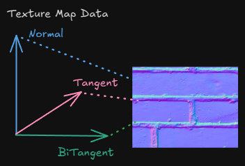
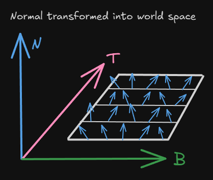

## 1. 프로젝트 개요
Vertex Format을 3D좌표, 텍스처 좌표, TBN 벡터로 구성하고 NormalMap 텍스처를 적용합니다.

샘플링한 NormalMap을 기저벡터 (TBN)을 활용해 변환하고 라이팅 처리를 합니다.

## 2. 핵심 기술 포인트

- 월드 공간에서 기저 벡터 (Basis Vector) 로 월드 변환 행렬 만들기
    - Tangent, BiTangent, Normal로 월드 변환 행렬 구성하기
- 접선 공간 ( Tangent Space ) 과 데이터
    - 표면의 법선 벡터를 텍스처에 RGB(0.0 ~ 1.0)로 저장한다. 이를 -1 ~ 1 범위로 사용한다.

## 3. 그래픽스 파이프라인에서의 위치

- Pixel Shader
    - 각 기저 벡터인 Tangent, BiTangent, Normal을 통해 TBN 월드 행렬을 만들고 샘플링한 접선 공간의 Normal를 월드로 변환하여 라이팅 계산에 사용한다.

## 4. 구현에서 중요한 지점

- TBN 벡터 만들기
    - 각 표면에 해당하는 Tangent, BiTangent, Normal 벡터를 만들고 해당 값을 GPU로 넘겨줍니다.
        
        ```cpp
        struct VS_INPUT
        {
            float4 Pos : POSITION0;
            float2 Tex : TEXCOORD;    
            float3 Tangent : TANGENT;
            float3 Bitangent : BINORMAL;    
            float3 Norm : NORMAL;
        };
        ```
        
    
    - 해당 프로젝트에서는 TBN을 직접 작성해서 넘겨줬습니다.
        
        ```cpp
        // Tangent, BiTangent, Normal
        Vector3(1, 0, 0), Vector3(0, 0, 1), Vector3(0, 1, 0) 	   // Normal Y +
        Vector3(0, 0, 1), Vector3(1, 0, 0), Vector3(0, -1, 0)	   // Normal Y -	
        Vector3(0, -1, 0), Vector3(0, 0, 1), Vector3(-1, 0, 0)	 //	Normal X -
        Vector3(0, 0, 1), Vector3(0, -1, 0), Vector3(1, 0, 0)	   // Normal X +
        Vector3(0, -1, 0), Vector3(-1, 0, 0), Vector3(0, 0, -1)  // Normal Z -
        Vector3(-1, 0, 0), Vector3(0, -1, 0), Vector3(0, 0, 1)   // Normal Z +
        ```
        
- Normal 텍스처 샘플링하기
    
    ```cpp
    // [0, 1]를 [-1, 1]로 변환
    float3 DecodeNormal(float3 N) 
    {
        return N * 2 - 1;
    }
    
    float3 normalMapSample = txNormal.Sample(samLinear, input.Tex).rgb; // 샘플링 하기
    float3 normalTexture = normalize(DecodeNormal(normalMapSample)); // 샘플링한 값 변환
    ```
    

- 샘플링한 노말 값을 TBN 월드 행렬로 변환
    
    ```cpp
    float3x3 TBN = float3x3(input.Tangent, input.Bitangent, input.Norm); // 열 우선 저장하므로 Transpose 한 것과 같음 
    float3 finalNorm = normalize(mul(normalTexture, TBN));
    ```
    

## 6. 실행 결과

## 7. 배운 점

1. 노말 맵은 면의 노말 벡터의 값을 색상 데이터로 저장한다.
    
    
    
2. TBN 월드 행렬을 이용해 Normal Texture에 있는 노말 벡터를 월드 위치로 변환하여 나온 값을 노말 값으로 사용한다.
    
    
    
    실제 엔진/ 그래픽스 에서는 아래와 같이 계산한다.
    
    - Tangent → 계산 또는 모델에서 읽음
    - Bitangent → 계산 (또는 sgn로 재구성)
    - Normal → **모델의 정점 데이터에 있는 Normal을 사용**
    
    bitangent는 밑과 같이 다시 만드는 경구가 많다.
    
    ```cpp
    bitangent = normalize(cross(normal, tangent) * tangent.w);
    ```
    
    tangent.w = +1 → 오른손 좌표계  
    
    tangent.w = -1 → 왼손 좌표계  