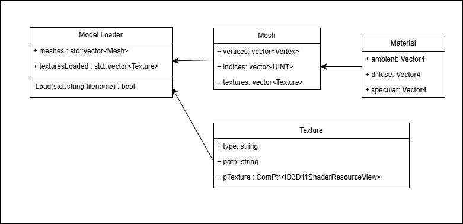

## 1. 프로젝트 개요
Assimp로 FBX 파일을 열고 테스트합니다.

StaticMesh를 그리기 위한 클래스를 구성합니다.

## 2. 핵심 기술 포인트

- Assimp에서 FBX파일을 aiScene로 임포팅하여 메쉬를 구성합니다.
- 각 매쉬를 구성하는 정점 정보와 텍스처를 담는 클래스를 만듭니다.

## 3. 그래픽스 파이프라인에서의 위치

- Input Assembler
    - 각 모델의 머터리얼 정보를 업데이트합니다.
    - 각 메쉬별 정점 버퍼와 인덱스 버퍼를 설정하고 Draw를 호출합니다.
- Pixel Shader
    - FBX의 각종 텍스처를 샘플링합니다. ( Diffuse, Emission, NormalMap )

## 4. 구현에서 중요한 지점
ModelLoader 클래스 구조는 다음과같다.

ModelLoader는 Load함수를 포함해 StaticModel이 사용하는 메쉬들과, 텍스처 정보를 가지고 있다.

Mesh 클래스는 각 메쉬의 정점, 인덱스 정보, 사용하는 텍스처를 담고 있다.

FBX파일을 불러올 때 `Assimp::importer` 객체의 ReadFile 함수로 불러오며 각종 flag를 설정할 수 있다.

aiNode를 읽을 때 meshes 데이터를 순회하면서 Mesh 클래스에 데이터를 저장한다.

## 6. 실행 결과

https://github.com/user-attachments/assets/9f53d981-a085-40b9-a8a8-351e8e4030ca

## 7. 배운 점

- Assimp의 aiScene이 구성하는 정보
    - aiScene - FBX 파일의 데이터 모음
    - aiNode - 모델의 Scene Graph를 표현한다.
        
        해당 내용에는 부모 관계, 매쉬의 개수, 자식 정보가 들어있다.
        
    - aiMaterial - 메쉬를 그리는 방법 또는 컬러를 결정하기 위한 정보를 소유하는 구조체
        
        Blender, Maya, Max등의 머터리얼에서 사용하는 각종 정보가 들어있다. ( 기본 색상, Mapping 소스, 셰이딩 (BSDF) 종류 등 )
        
    - aiTexture - 내장된 텍스처
        
        FBX에 파일에 내장(embedded)된 텍스처를 aiScene 내부의 멤버 aiTexture로 소유하는 텍스처다.
        
        aiMaterial에서 경로를 얻고  aiScene::GetEmbeddedTexture(const char* filename) 함수로 내부에 있는지 확인해야한다.
