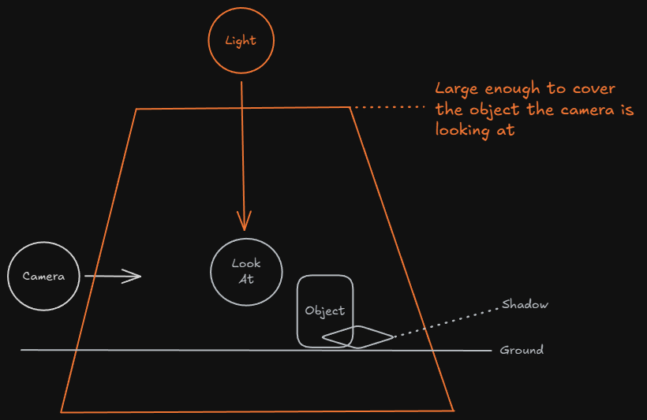
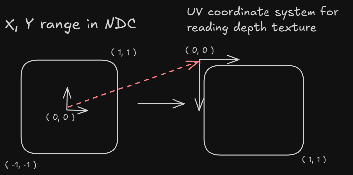

## 1. 프로젝트 개요
Shadow Mapping 기법을 구현하여 실시간 그림자를 추가합니다.

## 2. 핵심 기술 포인트

- 뎊스 맵 생성하는 렌더링 패스를 만듭니다. ( Depth Only Pass )
    
    광원 관점에서 장면을 랜더링하여 깊이 값을 텍스처로 저장합니다.
    
    주로 정점 셰이더를 사용하거나 간단한 픽셀 셰이더 ( 알파 테스팅이 필요한 경우 )를 사용합니다.
    

- Shadow Map 텍스처 생성
    - Format: DXGI_FORMAT_R32_TYPELESS (32비트 float)
    - Dual Binding:
    → DSV (Depth-Only Pass에서 쓰기용)
    → SRV (Render Pass에서 읽기용)
    - 해상도: 높을수록 선명한 그림자 (보통 1024×1024 ~ 4096×4096)
    
- 광원 Frustum 설정
    - 광원을 카메라처럼 취급
    - Position: 빛의 위치 (Directional Light는 무한 원점)
    - LookAt: 빛이 비추는 방향
    - Projection: 빛이 커버하는 영역 (Near/Far 조절 중요)
    - 모든 그림자 받을 오브젝트가 Frustum 안에 들어가야 함

## 3. 그래픽스 파이프라인에서의 위치
- Input Assembler

- 그림자 view 행렬과 projection 행렬 상수 버퍼에 추가
    
    ```cpp
    struct ConstantBuffer
    {
    	Matrix cameraView;
    	Matrix cameraProjection;
    
    	Vector4 lightDirection;
    	Matrix shadowView;
    	Matrix shadowProjection;
    
    	Color lightColor;
    
    	Vector4 ambient;	// 환경광
    	Vector4 diffuse;	// 난반사
    	Vector4 specular;	// 정반사
    	FLOAT shininess;	// 광택지수
    	Vector3 CameraPos;
    };
    ```
    

→ Depth Only Pass와 Render Pass에서 그림자 연산할 때 사용

- PS_INPUT에 그림자 위치 값 추가
    
    ```cpp
    struct PS_INPUT
    {
        float4 Pos : SV_POSITION;   // 투영한 위치 좌표
        float3 Norm : NORMAL;       // 노멀 값
        float2 Tex : TEXCOORD;      // 텍스처 UV좌표
        float3 World : TEXCOORD2;   // 월드 좌표
        
        float3 Tangent : TANGENT;
        float3 Bitangent : BINORMAL;
        
        float4 PositionShadow : TEXCOORD3; // 그림자 위치
    }; 
    ```
    

→ 그림자 텍스처 샘플링할 때 사용하기 위해 추가

- Vertex Shader

- 샘플링하기 위해 광원 기준 view, projection 연산 후 저장
    
    ```cpp
    output.PositionShadow = mul(float4(output.World, 1.0f), ShadowView);
    output.PositionShadow = mul(output.PositionShadow, ShadowProjection);
    ```
    

- Pixel Shader
    - 위에서 계산한 그림자 위치를 NDC 좌표로 변환해 직접광을 차단할 지 결정
        
        ```cpp
        float directLighing = 1.0f;
        // 광원 NDC 좌표계에서는 좌표는 계산해주지 않으므로 계산한다.
        float currentShadowDepth = input.PositionShadow.z / input.PositionShadow.w;
            
        // 광원 NDC 좌표계에서의 x(-1 ~ 1), y(-1 ~ 1)
        float2 uv = input.PositionShadow.xy / input.PositionShadow.w;
            
        // NDC좌표계에서 Texture 좌표계로 변환
        uv.y = -uv.y;
        uv = uv * 0.5 + 0.5;
            
        if (uv.x >= 0.0 && uv.x <= 1.0 && uv.y >= 0.0 && uv.y <= 1.0)
        {
            float sampleShadowDepth = txShadow.Sample(samLinear, uv).r;
                
            // currentShadowDepth가 더 크면 뒤 쪽에 있으므로 직접광 차단
            if (currentShadowDepth > sampleShadowDepth + 0.001)
            {
                directLighing = 0.0f;
            }
        } 
        ```
        

## 4. 구현에서 중요한 지점

- 광원 만들기
    
    
    
    해당 프로젝트는 위와 같이 만듭니다.
    
    빛이 보는 방향으로 절두체(proj)와 위치값, 그리고 바라보는 위치로 부터의 View 행렬을 만듭니다.
    
    ```cpp
    // 빛 계산 ( pov )
    m_shadowProj = XMMatrixPerspectiveFovLH(m_shadowFrustumAngle, m_shadowViewport.width / (FLOAT)m_shadowViewport.height, m_shadowNear, m_shadowFar); // 그림자 절두체
    
    m_shadowLookAt = m_Camera.m_Position + m_Camera.GetForward() * m_shadowForwardDistFromCamera;	// 바라보는 방향 = 카메라 위치 + 카메라 바라보는 방향으로부터 떨어진 태양의 위치
    
    m_shadowPos = m_Camera.m_Position + ((Vector3)-m_LightDirection * m_shadowUpDistFromLookAt);	// 위치
    
    m_shadowView = XMMatrixLookAtLH(m_shadowPos, m_shadowLookAt, Vector3(0.0f, 1.0f, 0.0f));
    ```
    
    절두체의 near과 far값은 오브젝트가 보이도록 적절하게 조절합니다.
    

- PS에서 그림자 맵 샘플링하기
    
    ```cpp
    float directLighing = 1.0f;
    // 광원 NDC 좌표계에서는 좌표는 계산해주지 않으므로 계산한다.
    float currentShadowDepth = input.PositionShadow.z / input.PositionShadow.w;
        
    // 광원 NDC 좌표계에서의 x(-1 ~ 1), y(-1 ~ 1)
    float2 uv = input.PositionShadow.xy / input.PositionShadow.w;
        
    // NDC좌표계에서 Texture 좌표계로 변환
    uv.y = -uv.y;
    uv = uv * 0.5 + 0.5;
        
    if (uv.x >= 0.0 && uv.x <= 1.0 && uv.y >= 0.0 && uv.y <= 1.0)
    {
        float sampleShadowDepth = txShadow.Sample(samLinear, uv).r;
            
        // currentShadowDepth가 더 크면 뒤 쪽에 있으므로 직접광 차단
        if (currentShadowDepth > sampleShadowDepth + 0.001)
        {
            directLighing = 0.0f;
        }
    }   
    ```
    

광원에서의 NDC 좌표계는 직접 계산을 하고 Texture를 읽기 위한 uv 좌표계로 변환합니다.



RenderPass NDC에서의 깊이 값과 그림자 깊이 값을 비교해 RenderPass 값이 더 크면 직접광을 차단합니다.

그렇지 않으면 directionLighting 값을 최종 연산에 곱하여 반영합니다.

## 5. 개발 과정에서 겪은 문제 & 해결

- Depth-Only Pass를 구성했지만 그림자가 안 나옴
    - 문제:
    Shadow Map 텍스처를 확인해보니 거의 흰색 (깊이 1.0)
    모델이 제대로 렌더링되지 않음
    - 원인:
    광원 Frustum의 Near/Far 값이 부적절
        - Near: 0.01 (너무 작음) → 오브젝트가 Near Plane 뒤쪽
        - Far: 100 (너무 작음) → 오브젝트가 Far Plane 너머
    
    결과: 모든 오브젝트가 클리핑되어 Shadow Map이 비어있음
    
    - 해결:
    ImGui로 Near/Far를 실시간 조절
    
    ```cpp
      ImGui::DragFloat("Shadow Near", &m_shadowNear, 0.1f);
      ImGui::DragFloat("Shadow Far", &m_shadowFar, 1.0f);
    
      // Near/Far 재계산
      m_shadowProj = XMMatrixPerspectiveFovLH(angle, aspect, m_shadowNear, m_shadowFar);
    ```

## 6. 실행 결과

## 7. 배운 점

- Depth Only Pass를 구성해 이를 이용해서 그림자 맵을 샘플링해 그림자를 구현할 수 있다.
- 매 패스를 구성할 때 뎊스 스텐실 뷰와 같은 세팅들은 초기화 하는 것이 좋다. 다음 패스 때 설정이 그대로 남아있어서 잘못 출력될 가능성이 있음.