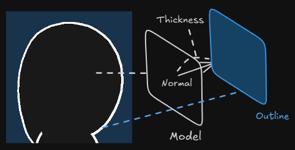
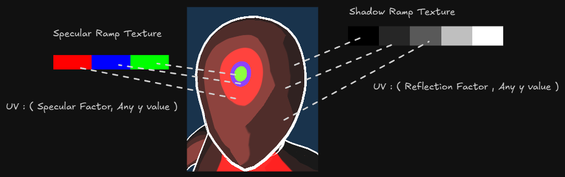

## 1. 프로젝트 개요
Cartoon Shading의 단계적 명함을 만들어 만화 스타일로 음영을 구현해보고 외곽선을 표현하는 것을 구현합니다.

## 2. 핵심 기술 포인트

- Outline Pass를 구성해 모델의 Outline을 랜더링합니다.
- Ramp Texure를 샘플링해 PS에서 음영을 단계별로 해당하는 위치의 색깔을 출력합니다.

## 3. 구현에서 중요한 지점

- Outline 구성하기
    
    
    
    - 법선 방향으로 모델을 약간 키우고 뒷면을 색칠해 실루엣을 만든다.
        
        ```cpp
        	rasterizerDesc.CullMode = D3D11_CULL_BACK;
        	rasterizerDesc.FillMode = D3D11_FILL_SOLID;
        	rasterizerDesc.DepthClipEnable = true;
        	rasterizerDesc.FrontCounterClockwise = true;
        ```
        
    
    - 법선 방향으로 thickness 값 만큼 크기를 키운다.
        
        ```cpp
            output.Pos.xyz += worldNormal * thickness;    
            output.Pos = mul(output.Pos, View);
            output.Pos = mul(output.Pos, Projection);
        ```
        

- Ramp Texutre 샘플링하기
    
    
    
    - 샘플링할 텍스처 슬롯 구성
    
    ```cpp
    // toonShader 용 텍스처
    Texture2D txDiffuseRamp : register(t4); 
    Texture2D txSpecRamp : register(t5);
    ```
    
    - diffuseRampTexture 샘플링
    
    ```cpp
    float NdotL = dot((float3) LightDirection, norm);
    
    // diffuse Ramp Texture 
    float2 diffuseRampUV = float2(NdotL, 0.5f);
    float4 diffuseRampSample = txDiffuseRamp.Sample(samLinear, diffuseRampUV);
    ```
    
    - SpecularRampTexure 샘플링
    
    ```cpp
    float specularFactor = specularIntensity * pow(saturate(dot(norm, normalize(halfVector))), Shininess);
            
    float2 specRampUV = float2(specularFactor, 0.5f);
    ```
    
    위 샘플링 내용을 마지막 색상에 추가합니다.
    
    ```cpp
    // Diffuse 결정
    finalDiffuse = finalTexture * diffuseRampSample * ...;
    
    // Specular 결정
    finalSpecular = specularFactorSmooth * specRampSample * ...;
    ```
    

## 4. 실행 결과


https://github.com/user-attachments/assets/0e4ee03b-a55b-4c08-8e35-305c31e9bd17


## 5. 배운 점

- 면을 뒤집어 외각선을 표현할 수 있다. 해당 설정은 래스터 라이저 설정을 통해 구성할 수 있다.
- Ramp Texture를 통해 단계별 색 표현이 가능하다.
