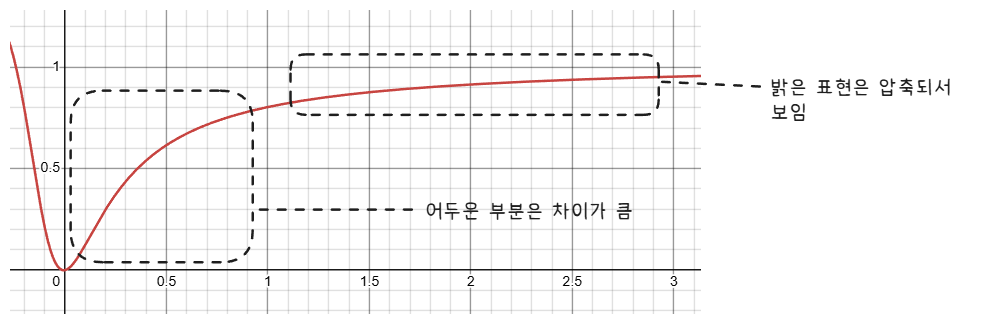
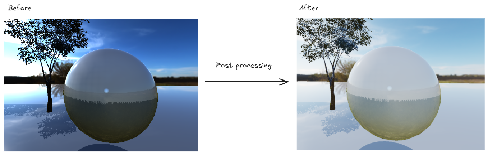

## 1. 프로젝트 개요

PBR로 계산한 선형 HDR 장면을 부동소수점 렌더 타깃에 먼저 기록하고, 전체 화면 Quad를 이용해 디스플레이 출력 형식에 맞게 Tone Mapping하는 프로젝트입니다.

SDR 출력에서는 ACES Filmic Tone Mapping과 감마 보정을 적용합니다. HDR 출력이 활성화된 디스플레이에서는 Rec.709 색을 Rec.2020 색역으로 변환하고 ST.2084(PQ)로 인코딩한 뒤 HDR10 색 공간으로 설정된 스왑 체인에 출력합니다.

## 2. 핵심 기술 포인트

- `DXGI_FORMAT_R16G16B16A16_FLOAT` HDR 중간 렌더 타깃 생성
- 장면 렌더링과 화면 출력 단계를 분리한 두 개의 Render Pass
- Exposure와 Light Intensity를 이용한 입력 밝기 조절
- ACES Filmic Tone Mapping 적용
- SDR 출력 시 선형 RGB를 감마 공간으로 변환
- HDR10 출력 시 Rec.709에서 Rec.2020으로 색역 변환
- ST.2084(PQ) 인코딩과 HDR10 스왑 체인 색 공간 설정
- 디스플레이의 현재 색 공간을 확인하여 SDR/HDR Pixel Shader 선택

## 3. 그래픽스 파이프라인에서의 위치

1. Depth-Only Pass
    - 광원 시점의 깊이를 Shadow Map에 기록합니다.

2. HDR Scene Pass
    - Skybox와 PBR 모델을 `R16G16B16A16_FLOAT` 렌더 타깃에 출력합니다.
    - PBR Pixel Shader는 감마 보정이나 Tone Mapping을 하지 않은 선형 HDR 색을 반환합니다.

3. Tone Mapping Pass
    - HDR 렌더 타깃을 Shader Resource View로 바인딩합니다.
    - NDC 범위를 채우는 Quad를 그리면서 SDR 또는 HDR Tone Mapping Pixel Shader를 실행합니다.

4. Output-Merger 단계
    - Tone Mapping 결과를 스왑 체인의 백 버퍼에 기록합니다.
    - HDR 모드에서는 스왑 체인 색 공간을 `DXGI_COLOR_SPACE_RGB_FULL_G2084_NONE_P2020`으로 지정합니다.

## 4. 구현에서 중요한 지점

### HDR 중간 렌더 타깃

```cpp
D3D11_TEXTURE2D_DESC td = {};
td.Width = static_cast<UINT>(m_ClientWidth);
td.Height = static_cast<UINT>(m_ClientHeight);
td.Format = DXGI_FORMAT_R16G16B16A16_FLOAT;
td.BindFlags = D3D11_BIND_RENDER_TARGET |
               D3D11_BIND_SHADER_RESOURCE;

m_pDevice->CreateTexture2D(&td, nullptr, &m_HDRRendertarget);
m_pDevice->CreateRenderTargetView(
    m_HDRRendertarget.Get(), nullptr, &m_HDRRenderTargetView);
m_pDevice->CreateShaderResourceView(
    m_HDRRendertarget.Get(), nullptr, &m_HDRShaderResourceView);
```

한 텍스처를 첫 번째 패스에서는 RTV로 사용하고, 두 번째 패스에서는 SRV로 사용합니다. 부동소수점 포맷을 사용하므로 1.0보다 큰 조명 값도 Tone Mapping 전까지 유지할 수 있습니다.

### 전체 화면 Quad 출력

```cpp
if (IsHDRSettingOn())
    m_pDeviceContext->PSSetShader(m_toneMappingPS_HDR.Get(), 0, 0);
else
    m_pDeviceContext->PSSetShader(m_toneMappingPS_LDR.Get(), 0, 0);

m_pDeviceContext->PSSetShaderResources(
    11, 1, m_HDRShaderResourceView.GetAddressOf());
m_pDeviceContext->DrawIndexed(m_quadIndicesCount, 0, 0);
```

Quad의 정점은 이미 NDC 좌표로 구성되어 있으므로 Vertex Shader에서는 별도의 World/View/Projection 변환 없이 화면 전체를 덮습니다.

### SDR Tone Mapping

```hlsl
float3 color = txSceneHDR.Sample(samLinear, input.tex).rgb;
color *= lightIntensity;
color *= pow(2.0f, exposure);
color = ACESFilm(color);
color = pow(color, 1.0f / 2.2f);
```

Exposure는 `2^exposure` 배율로 적용됩니다. ACES 근사 함수로 HDR 범위를 0~1 범위에 매핑한 뒤 감마 보정하여 SDR 백 버퍼에 기록합니다.

### HDR10 출력

HDR 출력에서는 다음 순서로 값을 변환합니다.

1. Light Intensity와 Exposure 적용
2. ACES Filmic Tone Mapping
3. Rec.709에서 Rec.2020으로 색역 변환
4. 디스플레이 기준 밝기를 10,000 nit PQ 범위에 맞게 스케일
5. ST.2084(PQ) 인코딩
6. `R10G10B10A2_UNORM` 백 버퍼에 출력

```cpp
swapChainDesc.Format = IsHDRSettingOn()
    ? DXGI_FORMAT_R10G10B10A2_UNORM
    : DXGI_FORMAT_B8G8R8A8_UNORM;

swapChain3->SetColorSpace1(
    DXGI_COLOR_SPACE_RGB_FULL_G2084_NONE_P2020);
```

## 5. 개발 시 주의할 점

1. 같은 텍스처를 RTV와 SRV로 동시에 바인딩할 수 없습니다.
    - Quad 출력이 끝난 뒤 `t11` 슬롯에 `nullptr`을 바인딩하여 HDR SRV를 해제합니다.
    - 다음 프레임에서 해당 텍스처를 다시 RTV로 사용하기 위한 처리입니다.

2. HDR 지원 여부와 실제 HDR 활성화 상태는 다를 수 있습니다.
    - 현재 코드는 `IDXGIOutput6::GetDesc1()`의 색 공간이 PQ/Rec.2020인지 확인합니다.
    - Windows 디스플레이 설정과 모니터 연결 상태에 따라 SDR 경로가 선택될 수 있습니다.

3. 스왑 체인 포맷과 색 공간 설정이 일치해야 합니다.
    - HDR 경로는 `R10G10B10A2_UNORM`과 PQ/Rec.2020 색 공간을 함께 사용합니다.
    - PQ 인코딩하지 않은 선형 값을 HDR10 백 버퍼에 직접 기록하면 의도한 밝기로 표시되지 않습니다.

4. `monitorMaxNit`은 현재 상수 버퍼의 고정값입니다.
    - 실제 디스플레이의 최대 휘도를 자동으로 반영하지 않으므로 모니터마다 결과 밝기가 다를 수 있습니다.

## 6. 실행 결과


## 7. 배운 점

- HDR 렌더링은 높은 범위의 색을 계산하는 단계와 디스플레이에 맞게 출력하는 단계를 분리해야 합니다.

- Tone Mapping은 HDR 값을 단순히 0~1로 자르는 대신 밝은 영역의 정보를 가능한 범위에서 압축합니다.


- HDR10 출력에는 색역 변환, PQ 인코딩, 스왑 체인 포맷과 색 공간 설정이 함께 필요합니다.

- 후처리 패스는 장면 결과를 텍스처로 저장한 뒤 전체 화면 Quad에서 다시 샘플링하는 방식으로 구성할 수 있습니다.
