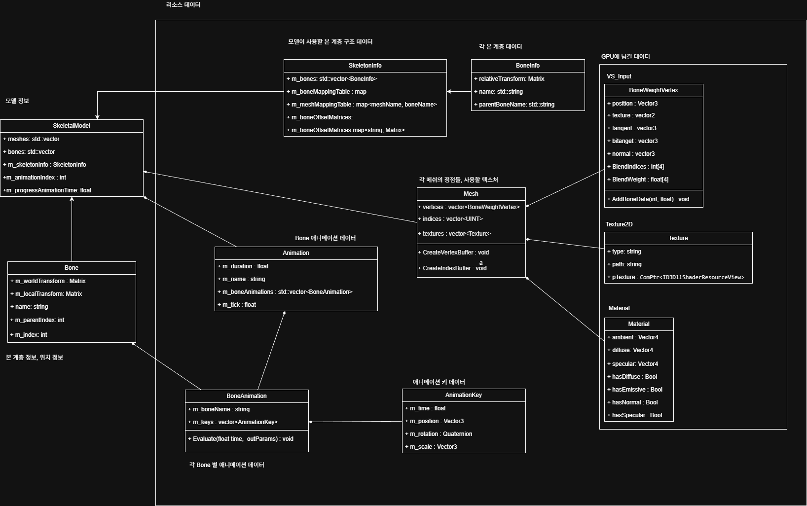

## 1. 프로젝트 개요
FBX에서 불러온 데이터에서 공유 데이터를 구분하여 관리하는 리소스 매니저를 만듭니다.

## 2. 핵심 기술 포인트

- 애니메이션 키프레임, 머터리얼, 버텍스 버퍼, 인덱스 버퍼, 계층 구조, 본 Offset 정보를 하나의 매니저 클래스가  weak_ptr로 소유하고 외부에 shared_ptr로 전달한다.
- IDGIDevice3::Trim() 함수로 VRAM/DRAM/pagefile.sys 리소스 제거 요청을 한다.

## 3. 구현에서 중요한 지점

- 기존에 FBX 파일 데이터를 리소스 데이터와 인스턴스 데이터로 구분합니다.
    
    
    

리소스 매니저가 저장할 구조체 만들기

```cpp
struct FBXResourceAsset
{
	SkeletonInfo skeletalInfo;
	std::vector<Animation> animations;
	std::vector<Mesh> meshes;
	std::vector<Texture> textures;

	std::string directory = "";
	BoneOffsetBuffer m_BoneOffsets{}; // skeletalInfo 본 위치 정보
};
```

- 중복되는 내용인 애니메이션, 메쉬, 텍스처 정보를 가지고 있는 구조체를 만들어 공유 데이터를 관리합니다.

## 4. 실행 결과


https://github.com/user-attachments/assets/5a12f6ed-938b-4d50-8baa-1b8f57d57657


## 5. 배운 점

- IDXGIDevice3::Trim() 을 통해 드라이버와 런타임이 캐싱해둔 리소스를 정리하여 시스템 메모리와 GPU 메모리를 절약할 수 있다.
- Animation, Mesh, Texutre, Bone Offset은 재활용하여 사용할 수 있다.
