# Rendering Pipeline

---

해당 문서는 마이크로소프트의 Direct3D 11의 [그래픽 파이프라인 문서](https://learn.microsoft.com/ko-kr/windows/win32/direct3d11/d3d10-graphics-programming-guide-input-assembler-stage-getting-started)를 기준으로 정리했습니다.

# 전체적인 파이프라인 순서

프로그래밍 가능한 스테이지 :                     

생략 가능한 스테이지 :                     

IA stage

vs stage

~~hs~~

~~ts~~

~~ds~~

gs 

rs stage

ps(fragment) stage

om stage

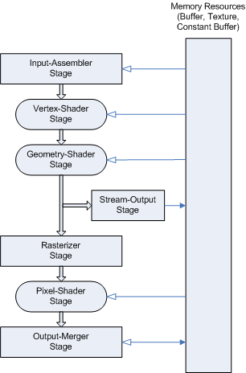

Microsoft의 DirectX10 랜더 파이프라인 작동 순서

# Input Assembler 스테이지

---

해당 스테이지에서는 버퍼의 기본 데이터(점, 선, 삼각형)을 읽고 다른 파이프 라인에서 데이터를 사용할 수 있게 기본 데이터로 조립합니다.

기본 데이터는 ID3D11DeviceContext::IASetPrimitiveTopology 함수를 통해 형식을 지정할 수 있습니다.

기본 데이터로 조립하는 동안 IA는 시스템 생성 값을 연결하여 셰이더를 보다 효율적으로 만듭니다.
시스템 생성값은 semantics라고 불리는 텍스트 문자열입니다.

각 세 개의 셰이더 단계(VS, GS, PS)는 시스템 생성 값을 사용합니다.

## IA 시작하기

---

Input Assembler는 초기화 하는 몇 가지 단계라 존재합니다. 해당 단계는 밑과 같습니다.

| 단계 | 묘사 |
| --- | --- |
| 입력 버퍼 만들기 | 입력 데이터를 사용하여 입력 버퍼를 만들고 초기화합니다. |
| Input-Layout 개체 만들기 | VertexShader가 읽을 데이터를 어떻게 해석할지 알려줍니다. |
| 기본 형식 (Primitive) 지정하기 | 어떤 형식으로 정점들 나열할지 결정합니다. |
| 개체를 Input-Assembler에 바인딩하기 | 위 단계들에서 만든 개체를 Input-Assembler에 바인딩합니다. |

1. input buffer 만들기
    
    
    [VertexBuffer 만들기](https://learn.microsoft.com/en-us/windows/win32/direct3d11/overviews-direct3d-11-resources-buffers-vertex-how-to)
    input buffer에는 두가지 타입인 vertex buffer과 index buffer가 있습니다.
    vertext buffer는 IA에게 사용할 vertex 데이터를 제공합니다.
    
    ```cpp
    // m_pDevice는 ID3D11Device*
    
    struct Vertex // vertex 데이터
    {
    	Vector3 position;
    };
    
    Vertex vertices[] = // buffer 생성하기
    {
    	Vector3(-0.5,-0.5,0.5), // v0
    	Vector3(0,0.5,0.5),		// v1
    	Vector3(0.5,-0.5,0.5),	// v2
    };
    
    // 버퍼 내용 설정하기
    D3D11_BUFFER_DESC vbDesc = {};
    ZeroMemory(&bufferDesc, sizeof(bufferDesc));	// 버퍼 초기화	
    m_VertexCount = ARRAYSIZE(vertices);
    vbDesc.ByteWidth = sizeof(Vertex) * m_VertexCount;	// 버텍스 버퍼의 크기 (Byte).
    vbDesc.CPUAccessFlags = 0;					// 0 == CPU 엑세스 필요하지 않음
    vbDesc.BindFlags = D3D11_BIND_VERTEX_BUFFER;	// 정적 버퍼로 사용.
    vbDesc.MiscFlags = 0;
    vbDesc.Usage = D3D11_USAGE_DEFAULT;		// CPU 접근 불가, GPU에서 읽기/쓰기로 가능한 버퍼로 생성
    
    // 정점 버퍼 생성
    D3D11_SUBRESOURCE_DATA vbData = {};
    vbData.pSysMem = vertices; // 버퍼를 생성할 때 복사할 데이터의 주소 설정
    m_pDevice->CreateBuffer(&vbDesc, &vbData, &m_pVertexBuffer);
    
    // IA에 바인딩하기
    m_pDeviceContext->IASetVertexBuffers(0, 1, &m_pVertexBuffer, &m_VertexBufferStride, &m_VertexBufferOffset);
    ```
    
    [index buffer 만들기](https://learn.microsoft.com/en-us/windows/win32/direct3d11/overviews-direct3d-11-resources-buffers-index-how-to) 
    
    index buffer는 vertex buffer에서 각 각 vertex의 인덱스를 제공합니다. 
    
    ( index buffer는 선택적으로 추가할 수 있습니다. )
    
    ```cpp
    unsigned int indices[] = { 0, 1, 2 };
    
    // 버퍼 내용 설정하기
    D3D11_BUFFER_DESC psDesc = {};
    ZeroMemory(&bufferDesc, sizeof(bufferDesc));	// 버퍼 초기화
    m_IndexCount = ARRAYSIZE(indices);
    psDesc.ByteWidth = sizeof(unsigned int) * m_IndexCount;
    psDesc.CPUAccessFlags = 0;
    psDesc.BindFlags = D3D11_BIND_INDEX_BUFFER;
    psDesc.MiscFlags = 0;
    psDesc.Usage = D3D11_USAGE_DEFAULT;
    
    // 인덱스 버퍼 생성
    m_pDevice->CreateBuffer(&psDesc, &psData, &m_pIndexBuffer);
    
    // IA에 바인딩하기
    m_pDeviceContext->IASetIndexBuffer(m_pIndexBuffer, DXGI_FORMAT_R32_UINT, 0);
    ```
    
2. input-Layout 객체 만들기
vectex shader가 사용할 vertex의 각 요소를 알려주는 역할을 합니다.

```cpp
D3D11_INPUT_ELEMENT_DESC layout[] =
{
	{"POSITION", 0, DXGI_FORMAT_R32G32B32_FLOAT, 0, 0, D3D11_INPUT_PER_VERTEX_DATA, 0},
	{"COLOR", 0, DXGI_FORMAT_R32G32B32A32_FLOAT, 0, 12, D3D11_INPUT_PER_VERTEX_DATA, 0}
};
```

위 예제는 요소는 밑과 같습니다.

첫번째 행 : 요소의 x,y,z의 위치 데이터

두번째 행 : 해당 요소의 색깔 데이터

[D3D11_INPUT_ELEMENT_DESC 구조체](https://learn.microsoft.com/ko-kr/windows/win32/api/d3d11/ns-d3d11-d3d11_input_element_desc)

해당 구조체로 VectexShader에 전달할 요소를 정의합니다.

```cpp
typedef struct D3D11_INPUT_ELEMENT_DESC
    {
    LPCSTR SemanticName;
    UINT SemanticIndex;
    DXGI_FORMAT Format;
    UINT InputSlot;
    UINT AlignedByteOffset;
    D3D11_INPUT_CLASSIFICATION InputSlotClass;
    UINT InstanceDataStepRate;
    } 	D3D11_INPUT_ELEMENT_DESC;

```

SemanticName

셰이더에서 사용할 sematic 이름입니다.

SemanticIndex

요소의 의미 체계 인덱스입니다. 동일한 의미 체계를 가진 요소가 둘 이상일 때만 사용합니다.

Format

요소의 [데이터 형식](https://learn.microsoft.com/ko-kr/windows/win32/api/dxgiformat/ne-dxgiformat-dxgi_format)입니다. 

InputSlot

Input-assembler를 식별하는 정수 값입니다. **여러 개의 버퍼를 사용하는 경우 지정합니다.**

Input-assembler는 n개의 정점 버퍼를 수용할 수 있게 설계되어 있습니다.

데이터는 아래와 같은 input slot에 들어가게 됩니다.

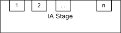

Input slot 그림

AlignedByteOffset 

정보를 읽을 시작 위치를 정한다. (단위는 Byte)

편의를 위해 D3D11_APPEND_ALIGNED_ELEMENT를 사용하면 바로 이전 요소의 다음 위치를 현재 위치로 정의할 수 있다.

InputSlotClass

단일 입력 슬롯에 대한 입력 데이터 형식을 지정합니다.

InstanceDataStepRate

버퍼에서 하나의 요소로 진행하기 전에 동일한 instance별 데이터를 사용하여 그릴 인스턴스 수입니다. 꼭짓점별 데이터(D3D11_INPUT_PER_VERTEX_DATA)가 포함된 요소의 경우 이 값은 0이어야 합니다

1. primitive topologies 형식 지정하기
해당 함수는 파이프 라인에서 어떻게 렌더링할 지 설정합니다.
    
    ```cpp
    m_pDeviceContext->IASetPrimitiveTopology(D3D11_PRIMITIVE_TOPOLOGY_TRIANGLELIST);
    ```
    


출력 방식 리스트

# Vertex Shader 스테이지

---

정점 셰이더(VS) 단계는 입력 어셈블러에서 전달된 정점을 처리하여 변환, 스키닝, 모핑, 정점별 조명과 같은 정점 별 연산을 수행합니다. 

정점 셰이더는 항상 단일 입력 정점에 대해 동작하고 단일 출력 정점을 생성합니다.

## Vertex Shader의 역할

---

정점 셰이더는 입력된 정점의 좌표를 받아 오브젝트(모델) → 월드 → 뷰(Eye) → 클립 공간 순서로 좌표를 변환합니다.

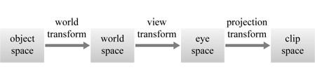

정점 셰이더의 좌표계 변환 과정

사용하는 행렬 종류

- 월드 변환 행렬 : 오브젝트 로컬 좌표→ 월드 좌표
- 뷰 변환 행렬 : 월드 좌표 → 카메라 좌표
- 투영 변환 행렬 : 카메라 좌표 → 클립 좌표

정점 쉐이더 코드

```cpp
cbuffer ConstantBuffer : register(b0)
{
    matrix World;
    matrix View;
    matrix Projection;
}

struct PS_INPUT
{
    float4 Pos : SV_POSITION;
}; 

PS_INPUT main(float4 Pos : POSITION)
{
    PS_INPUT output = (PS_INPUT) 0;
    output.Pos = mul(Pos, World); // 모델 -> 월드
    output.Pos = mul(output.Pos, View);  // 월드 -> 뷰
    output.Pos = mul(output.Pos, Projection); // 뷰 -> 투영
    return output;
} 
```

### **월드 변환**

---

개체를 만드는데 사용되는 좌표계는 오브젝트의 고유 좌표값입니다. 이 값들을 모든 개체가 포함된 월드 공간에 연결합니다.

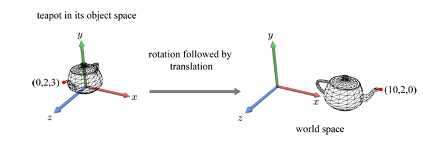

찻주전자오브젝트를 월드 공간으로 변환하는 그림 

### **뷰 변환**

---

월드 공간을 보기 위해 우리는 가상의 눈 또는 카메라를 밑의 3가지의 매개변수를 사용하여 월드 공간에 정의합니다.

- Eye : 눈의 위치
- At : 눈이 바라보는 기준 점
- Up : Eye 위치에서 위를 바라보는 벡터

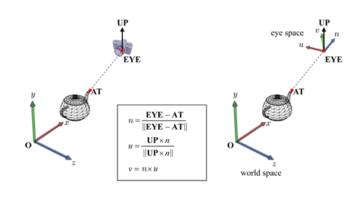

뷰 공간 계산 그림

$n$ : Eye - AT으로 방향을 구합니다.

$u$ : Eye를 기준으로  위를 바라보는 벡터 Up을 이용해 up과 n을 외적하여 오른쪽을 바라보는 새로운 방향 벡터 u를 구합니다.

$v$ : 위에서 구한 n과 u를 외적하여 y축이 될 새로운 방향 벡터 v를 구합니다.

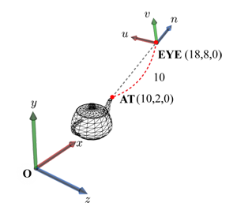

Eye를 기준으로 한 찻주전자의 새로운 좌표 그림

위에서 구한 $n, u, v$를 이용해 새로운 좌표계를 통해 찻잔의 위치를 해당 공간 좌표계를 기준으로 다시 정렬합니다.

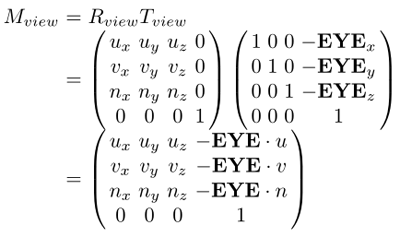

OpenGL 기준 뷰 행렬

### **View 절두체(Frustum) 및 투영 변환**

→ orthographic,  perspective 정리하기

월드 공간 좌표계는 필요 없기 때문에 위에서 정의한 { u, v, n }은 이제 우리에게 더 익숙한 { x, y, z }로 바꿔서 부르겠습니다.

View 공간에서는 밑의 4개의 매개변수를 이용해 얼마나 많은 공간을 볼지 정의합니다.

- fovy : y축에 따른 시야(field of view)를 나타냅니다.
- aspect : 시야의 종횡비
- n : Eye에서 near clipping plane까지 거리입니다.
- f : Eye에서 far clipping plane까지 거리입니다.

위 매개변수들을 통해 밑 그림과 같이 Eye에 있는 잘린 피라미드 모양을 만듭니다. 이를 절두체(Frustum)이라고 합니다.

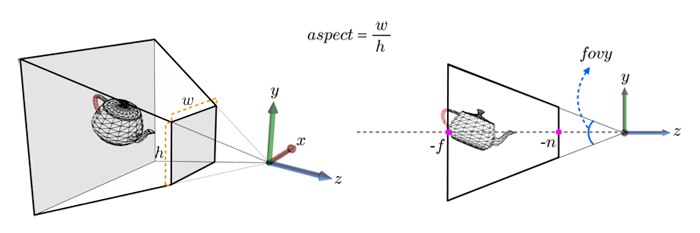

매개변수 4개를 이용한 절두체 정의 그림

위 그림에서 찻주전자는 절두체와 교차하고 있습니다. 절두체 안에 있는 내용만 보이도록 절두체 밖으로 나간 부분을 잘라줍니다.

그리고 절두체를 축 정렬된 상자로 변환됩니다. 이를 투영 변환이라고 합니다.

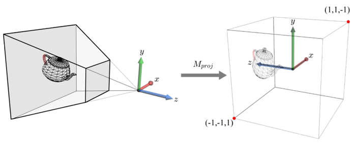

투영 변환된 찻 주전자

투영 행렬은 밑 그림과 같이 절두체에 사용했던 매개변수인 fovy, aspect, n, f를 사용하여 정의됩니다.

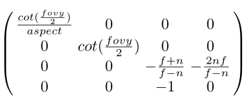

투영 행렬 

### Vertex Shader 생성하기 및 .hlsl 작성하기

---

VertexShader.hlsl

```cpp
struct VS_INPUT
{
    float3 pos : POSITION;
    float4 col : COLOR;
};

struct PS_INPUT
{
    float4 pos : SV_POSITION;
    float4 col : COLOR;
};

PS_INPUT main(VS_INPUT input)
{
    PS_INPUT output;
    
    output.pos = float4(input.pos, 1.0f); // 위치 결정
    output.col = input.col; // 색상 결정
    
	return output;
}
```

1. Vertex Shader 생성하기

```cpp
	// 버텍스 셰이더 생성
	ID3DBlob* vertexShaderBuffer = nullptr;
	HR_T(CompileShaderFromFile(L"BasicVertexShader.hlsl", "main", "vs_4_0", &vertexShaderBuffer));
	HR_T(m_pDevice->CreateVertexShader(vertexShaderBuffer->GetBufferPointer(), vertexShaderBuffer->GetBufferSize(), NULL, &m_pVertexShader));
```

1. Vertex Shader 설정하기

```cpp
// m_pVertexShader는 ID3D11VertexShader*

m_pDeviceContext->VSSetShader(m_pVertexShader, nullptr, 0);
```

# 래스터라이저 스테이지

---

래스터화 단계는 실시간 3D 그래픽을 표시하기 위해 벡터 정보(형태 또는 기본 요소로 구성)를 래스터 이미지(픽셀로 구성)로 변환합니다.

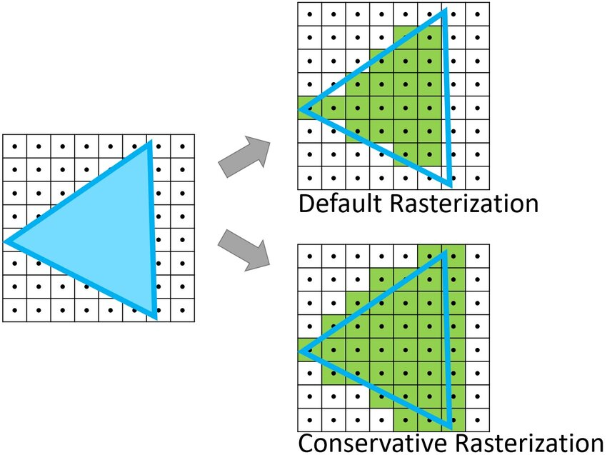

래스터화 동안 각 기본 요소는 픽셀로 변환되며 각 기본 요소에 걸쳐 꼭짓점별 값을 보간합니다.

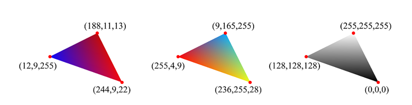

> 색깔이 보간된 삼각형 그림
> 

래스터화에는 시야 절두체로 꼭짓점 클리핑, z로 나누기 수행을 통한 원근 제공, 기본 요소를 2D 뷰포트로 매핑, 픽셀 셰이더 호출 방법 결정이 포함됩니다. 

픽셀 셰이더 사용은 선택적이지만 래스터라이저 단계는 항상 클리핑, 원근 분할을 수행하여 점을 같은 공간으로 변환하고, 꼭짓점을 뷰포트에 매핑합니다.

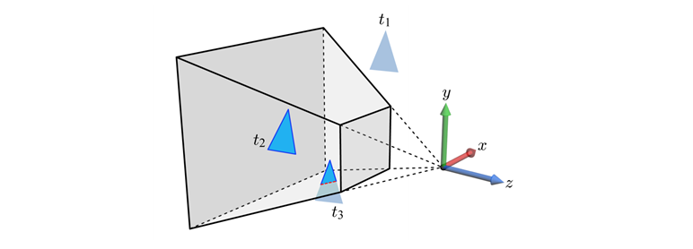

래스터라이저 단계로 들어오는 꼭짓점(x,y,z,w)은 같은 유형의 클립 공간에 있는 것으로 간주됩니다. 이 좌표 공간에서 X축은 오른쪽, Y축은 위쪽, Z축은 카메라에서 먼 쪽을 가리킵니다.

1. 뷰포트 설정하기

```cpp
	// 뷰포트 설정하기
	D3D11_VIEWPORT viewport = {};
	viewport.TopLeftX = 0;
	viewport.TopLeftY = 0;
	viewport.Width = (float)m_ClientWidth;
	viewport.Height = (float)m_ClientHeight;
	viewport.MinDepth = 0.0f;
	viewport.MaxDepth = 1.0f;
	
	// 뷰포트 설정
	m_pDeviceContext->RSSetViewports(1, &viewport);
```

# Pixel Shader 스테이지

---

Pixel Shader는 상수 변수, 텍스쳐 데이터, 보간된 꼭짓점 값 및 기타 데이터를 결합하여 각 픽셀에 출력할 색을 반환한다.

PixelShader.hlsl

```cpp
struct PS_INPUT
{
    float4 pos : SV_POSITION;
    float4 col : COLOR;
};

float4 main(PS_INPUT input) : SV_TARGET
{
    return input.col; // 정점 색상 그대로 출력
}
```

1. 픽셀 셰이더 설정하기

```cpp
// m_pPixelShader는 ID3D11PixelShader*
	
// 픽셀 세이더 생성
ID3DBlob* pixelShaderBuffer = nullptr;
CompileShaderFromFile(L"BasicPixelShader.hlsl", "main", "ps_4_0", &pixelShaderBuffer);
m_pDevice->CreatePixelShader(pixelShaderBuffer->GetBufferPointer(), pixelShaderBuffer->GetBufferSize(), NULL, &m_pPixelShader);

// Pixel Shader 바인딩
m_pDeviceContext->PSSetShader(m_pPixelShader, nullptr, 0);
```

# Output Merger 스테이지

---

Output Merger는 파이프 라인 상태, 픽셀 셰이더에서 생성된 픽셀 데이터, 렌더링 대상의 내용 및 깊이 / 스텐실 버퍼의 내용을 조합하여 최종 렌더링될 픽셀 색을 생성합니다.

OM 단계에서는 어떤 픽셀(깊이 스텐실 테스트 포함)이 보이는지 확인하고 최종 색을 블랜딩합니다.

1. Depth-Stencil 테스트 ( z버퍼링 )
    
    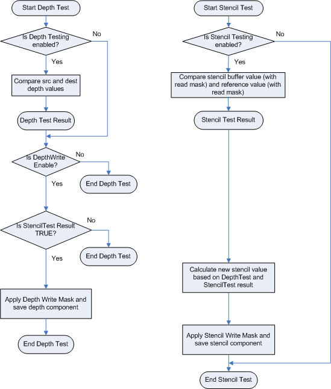
    
    깊이 버퍼를 사용하여 픽셀을 결정합니다.
    
    만약 애플리케이션에서 지정하지 않으면 OM단계에서 기본 값을 사용합니다.
    
    1. Blending
    
    
    
    블랜딩은 하나 이상의 픽셀 값을 결합하여 최종 픽셀 색을 만듭니다.
    

# 참고 문서

---

[https://learn.microsoft.com/ko-kr/windows/win32/direct3d10/d3d10-graphics-programming-guide-pipeline-stages?source=recommendations](https://learn.microsoft.com/ko-kr/windows/win32/direct3d10/d3d10-graphics-programming-guide-pipeline-stages?source=recommendations)

[https://microsoft.github.io/DirectX-Specs/d3d/archive/D3D11_3_FunctionalSpec.htm#Rendering Pipeline Overview Changes](https://microsoft.github.io/DirectX-Specs/d3d/archive/D3D11_3_FunctionalSpec.htm#Rendering%20Pipeline%20Overview%20Changes)

[https://docs.tizen.org/application/native/guides/graphics/vertex-shader/](https://docs.tizen.org/application/native/guides/graphics/vertex-shader/)
